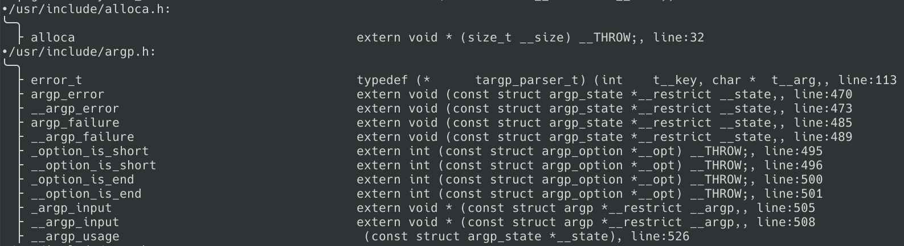

code-ls: List the functions and files for a codebase.
=====================================================
code-ls works by parsing a cscope database that is provided as input.  code-ls
will then locate the function definitions from that cscope database and

Usage
-----
You must have a cscope database for your codebase.  This must be uncompressed,
if you have [cscope](http://cscope.sourceforge.net/) installed, then you can
run it on your codebase via `cscope -Rbc -s=<path to your codebase>`.  Note
that the '-c' flag disables compression, code-ls does not understand compressed
cscope databases.  This will produce a file named `cscope.out`.

Now you can use that database (`cscope.out`) as input to code-ls:
`cargo run -- -f cscope.out`

Building
--------
`cargo build`

Dependencies
------------
* [rust,cargo](https://www.rust-lang.org/): Rust and cargo.
* [cscope](http://cscope.sourceforge.net): Cscope code indexing tool.

Resources
---------
The cscope database format is internal to cscope and is not published.
I did find an older man page published with the format specified, so that is
what we are using for code-ls.  This is that aforementioned manpage.
https://codecat.tistory.com/entry/cscope-manpage

Screen Shot
-----------

Contact
-------
Matt Davis: https://github.com/enferex
